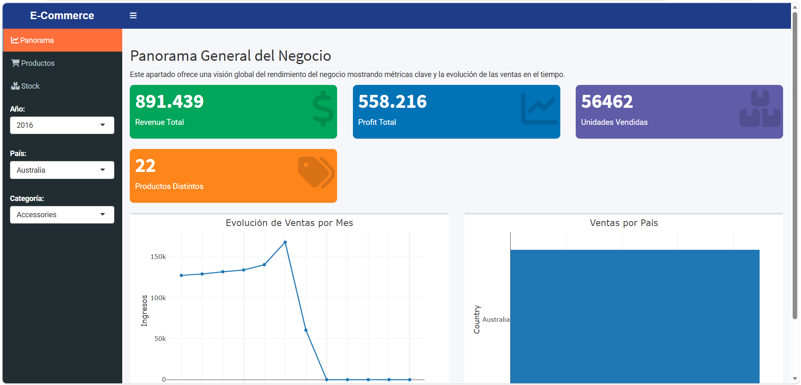

# 📊 Dashboard de Ventas e Inventario – R Shiny

Este proyecto consiste en un dashboard interactivo desarrollado en R Shiny para analizar ventas e inventario de un negocio de e-commerce.

## 🎯 Objetivo
El objetivo principal es explorar métricas clave como ingresos, beneficios, unidades vendidas y diversidad de productos, además de identificar patrones de demanda y estacionalidad para apoyar decisiones estratégicas.

## 📊 Dataset
Fuente: Kaggle (E-Commerce Dataset, ~113k registros).  
Variables principales: Año, País, Categoría de producto, Precio unitario, Cantidad, Costo, Ingreso.

## ⚙️ Instalación
1. Clonar este repositorio:
   ```
   git clone https://github.com/benjamingaleano334/dashboard_r.git
   ```
2. Abrir RStudio en la carpeta del proyecto.  
3. Instalar las librerías necesarias:
   ```
   install.packages(c("shiny", "shinydashboard", "plotly", "DT", "dplyr"))
   ```

## ▶️ Uso local
1. Abrir el archivo `app.R` o el conjunto `ui.R`, `server.R`, `global.R`.  
2. Ejecutar en RStudio:
   ```
   shiny::runApp()
   ```
3. El dashboard se abrirá en tu navegador en `http://127.0.0.1:xxxx`.

## 🌐 Demo en línea
Podés ver el dashboard funcionando aquí:  
👉 [https://benjamingaleano334.shinyapps.io/dashboard_r/](https://benjamingaleano334.shinyapps.io/dashboard_r/)

## 🖼️ Vista previa



## 📑 Informe
El repositorio incluye el archivo `informe.pdf` con la narrativa del proyecto, contexto, hallazgos y conclusiones.

## 👤 Autor
Benjamín Galeano – Trabajo Práctico Integrador de Ciencia de Datos

